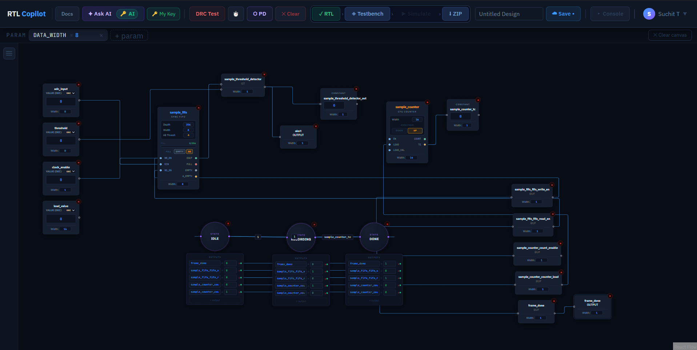
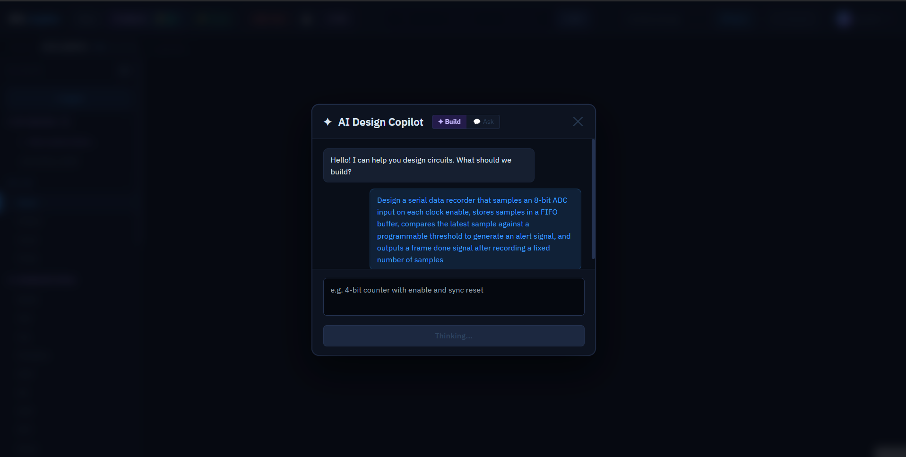
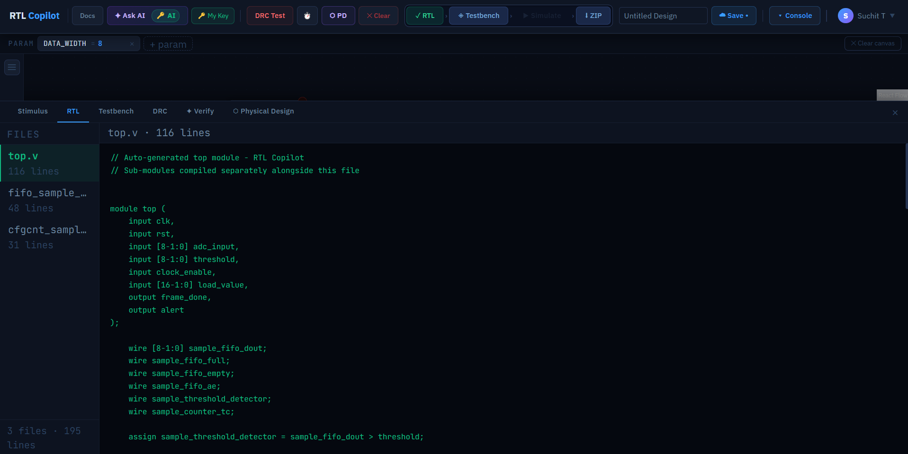
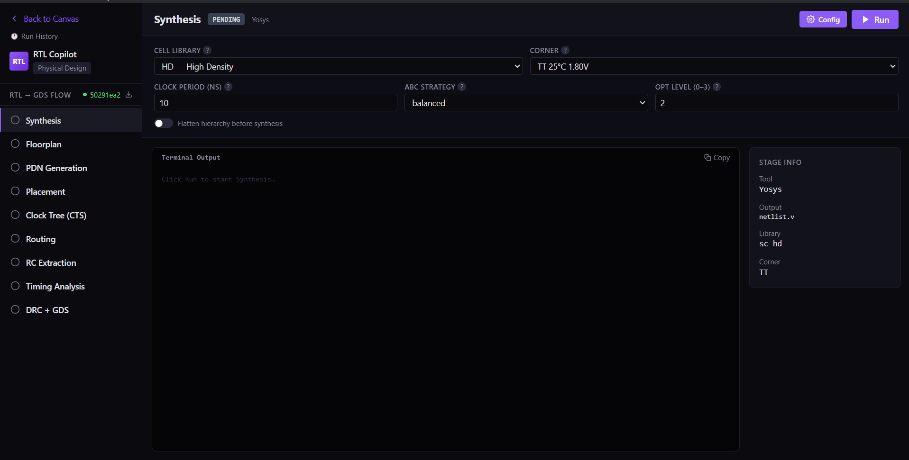

# RTLCopilot

**AI-assisted RTL design tool. Draw circuits visually, describe them in plain English, simulate, and take your design all the way to GDS — on your desktop.**

> RTLCopilot was created by [Suchit Tilak](https://github.com/Suchit18).


---

## What it does

RTLCopilot is an open source hardware design tool that lets you:

- **Draw circuits visually** — drag and drop logic blocks onto a canvas and wire them together
- **Generate Verilog with AI** — describe a circuit in plain English and get production-ready Verilog
- **Simulate** — run iverilog simulations with AI-assisted failure analysis
- **Create custom blocks** — define your own reusable Verilog blocks with a guided form
- **Full RTL to GDS** — synthesise, floorplan, place, route, and export GDS using open source EDA tools running in Docker

RTL Brain (the AI generation pipeline) is experimental. It works well for common circuit patterns and is actively being improved. Community contributions to RTL Brain are especially welcome.


## Screenshots


*AI-generated serial data recorder — FIFO, FSM, counter, threshold detector all wired automatically*


*Describe a circuit in plain English — RTL Brain decomposes and builds it on the canvas*


*Clean, hierarchical Verilog output — multiple sub-modules generated alongside top.v*


*Full RTL to GDS flow — Synthesis, Floorplan, Placement, CTS, Routing, DRC all in one tool*

---
---

## Information Page

[rtlcopilot.com](https://rtlcopilot.com)

---

## Tech stack

| Layer | Technology |
|---|---|
| Frontend | React, ReactFlow, Electron |
| Backend | FastAPI (Python) |
| Auth + DB | Supabase |
| Verilog emit | Custom deterministic emitter (`backend/rtl_codegen/`) |
| Simulation | iverilog + vvp |
| AI | BYOK — bring your own OpenAI / Groq / NVIDIA NIM key |
| PD tools | OpenROAD, Yosys, Sky130 PDK (via Docker) |

---

## Project structure

```
rtlcopilot/
├── backend/                    ← Main FastAPI backend
│   ├── api.py                  ← Routes + RTL Brain pipeline (~7400 lines)
│   ├── block_mapper.py         ← Generic → primitive block mapping
│   ├── known_circuits.py       ← Hardcoded known circuit hierarchies
│   ├── net_ir.py               ← IR validation
│   ├── requirements.txt
│   ├── .env.example
│   └── rtl_codegen/            ← Verilog emitters
│       ├── emit_verilog.py
│       ├── emit_fifo.py
│       ├── emit_cfg_counter.py
│       └── ...
├── frontend/                   ← Electron + React canvas
│   ├── src/
│   │   ├── App.jsx
│   │   ├── components/
│   │   └── ...
│   ├── package.json
│   └── .env.example
├── pd/                         ← Physical design pipeline (runs in Docker)
│   ├── api.py                  ← PD server: synthesis, floorplan, routing, GDS
│   ├── Dockerfile              ← OpenROAD + Yosys + Sky130 PDK
│   ├── docker-compose.yml      ← Start PD tools with one command
│   └── work/                   ← PD run outputs (gitignored)
├── README.md
├── CONTRIBUTING.md
├── KNOWN_ISSUES.md
├── LICENSE
├── schema.sql                  ← Supabase table definitions
└── .gitignore
```

---

## Local setup

### Prerequisites

- Python 3.10+
- Node.js 18+
- [iverilog](https://steveicarus.github.io/iverilog/) v12.0+ installed and on PATH — Windows: [download installer](https://bleyer.org/icarus/)
- [Docker Desktop](https://www.docker.com/products/docker-desktop/) (for PD flow)
- A free [Supabase](https://supabase.com) project
- An API key from OpenAI, Groq, or NVIDIA NIM (BYOK)

---

### 1. Clone

```bash
git clone https://github.com/rtlcopilot/rtlcopilot.git
cd rtlcopilot
```

---

### 2. Database

Run `schema.sql` in your Supabase project's SQL editor to create all required tables.

Enable Google OAuth in your Supabase project:
**Authentication → Providers → Google → Enable**

---

### 3. Backend

```bash
cd backend
cp .env.example .env   # Windows CMD: use "copy .env.example .env"
# Fill in SUPABASE_URL and SUPABASE_SERVICE_KEY in .env
pip install -r requirements.txt
uvicorn api:app --port 8080
```

---

### 4. Frontend

```bash
cd frontend
cp .env.example .env # Windows CMD: use "copy .env.example .env"
# Fill in VITE_SUPABASE_URL, VITE_SUPABASE_ANON_KEY, VITE_API_URL in .env
npm install
npm run dev
```

---

### 5. PD tools (Docker)

The physical design pipeline runs inside a Docker container with OpenROAD, Yosys, and the Sky130 PDK pre-installed.

```bash
cd pdtools
docker compose up
```

This pulls the pre-built `rtlcopilot/pd-tools:latest` image from Docker Hub (~9GB) and starts the PD server on port 7070.

> **Note:** Docker Desktop must have at least 8GB RAM allocated.
> Settings → Resources → Memory → 8GB+

The PD server exposes these endpoints on `http://localhost:7070`:
- `POST /synthesise` — Yosys synthesis
- `POST /floorplan` — OpenROAD floorplan
- `POST /place` — placement
- `POST /cts` — clock tree synthesis
- `POST /route` — routing
- `POST /drc` — design rule check
- `POST /export/gds` — GDS export

Run outputs are written to `pd/work/` on your machine.

---

### 6. Set your API key

Click **🔑 API Key** in the toolbar and enter your OpenAI / Groq / NVIDIA NIM key. All AI features use your own key — no credits system.

---

## RTL Brain — AI pipeline

RTL Brain converts natural language circuit descriptions into Verilog through a 4-stage pipeline:

```
Stage 0 — Decompose prompt into generic blocks
Stage 1 — Wire blocks and assign parameters
Stage 2 — Extract connectivity
Stage 3 — Generate FSM transition tables
```

It is **experimental**. Known limitations are documented in [KNOWN_ISSUES.md](KNOWN_ISSUES.md). Contributions to improve it are very welcome.

---

## Acknowledgements

RTLCopilot builds on the shoulders of incredible open source projects:

- [Yosys](https://yosyshq.net/yosys/) — open source synthesis suite by Clifford Wolf
- [OpenROAD](https://theopenroadproject.org/) — open source RTL-to-GDS flow
- [KLayout](https://www.klayout.de/) — GDS viewer and DRC engine
- [Sky130 PDK](https://github.com/google/skywater-pdk) — open source process design kit by SkyWater and Google
- [iverilog](https://steveicarus.github.io/iverilog/) — open source Verilog simulator by Stephen Williams
- [ReactFlow](https://reactflow.dev/) — canvas library powering the visual designer
- [Supabase](https://supabase.com/) — open source Firebase alternative for auth and storage

RTLCopilot would not exist without these projects and the communities behind them.

---

## Contributing

See [CONTRIBUTING.md](CONTRIBUTING.md).

---

## License

AGPL-3.0 — see [LICENSE](LICENSE).

RTLCopilot was created by Suchit Tilak. Copyright (c) 2026 RTLCopilot Contributors.